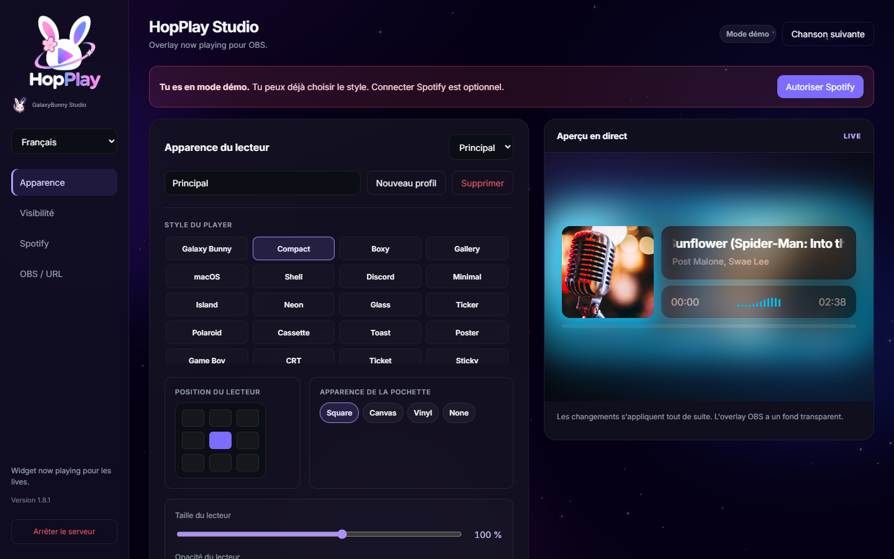

<p align="center">
  
</p>

<h1 align="center">HopPlay</h1>
<p align="center"><strong>GalaxyBunny Studio</strong> · now-playing overlay</p>

<p align="center">
  Local overlay for <strong>OBS</strong> and <strong>Streamlabs</strong> — title, artist, artwork, Galaxy Bunny skins.<br>
  Demo mode with no account. Spotify optional.
</p>

<p align="center">
  <a href="https://hanacherry.github.io/hopplay/?lang=en"></a>
  <a href="LICENSE"></a>
  <a href="package.json"></a>
  <a href="https://github.com/HanaCherry/hopplay/releases/latest"></a>
</p>

<p align="center">
  <a href="README.md">Français</a> ·
  <a href="README.en.md">English</a> ·
  <a href="https://hanacherry.github.io/hopplay/?lang=en">All languages on the site</a>
</p>

<p align="center">
  <a href="https://hanacherry.github.io/hopplay/?lang=en">Presentation site</a>
  ·
  <a href="https://github.com/HanaCherry/hopplay/releases/latest">Latest release</a>
</p>

<p align="center">
  
</p>

## Now playing, on stream

HopPlay is a **now-playing overlay** for streamers: local dashboard, 61 skins including **Galaxy Bunny**, transparent OBS / Streamlabs source, up to 5 profiles.

**Demo mode** works with no account. Spotify and Windows detection stay optional. Nothing is sent to a GalaxyBunny server.

## Preview

<p align="center">
  
</p>

<p align="center">
  
</p>

## Features

- **61 skins** — Galaxy Bunny, kawaii, chrome, walkman, film, sakura, tarot, arcade
- **OBS / Streamlabs overlay** — Browser source, transparent background, 9 positions
- **Spotify or local** — optional account, Windows detection, or silent demo
- **Look** — magic colors, glow, blur, visualizer, square / canvas / vinyl covers
- **5 profiles** — separate OBS URL, size, and opacity
- **Private by design** — the server listens on `127.0.0.1`; `data/` is never published

## Quick start

Install [Node.js 18+](https://nodejs.org), then:

```sh
git clone https://github.com/HanaCherry/hopplay.git
cd hopplay
npm install
npm start
```

Open `http://127.0.0.1:3000`. Demo mode works immediately.

On Windows, `start.bat` also starts the server. `stop.bat` stops it.

## OBS / Streamlabs

1. Start HopPlay and leave it running during the stream.
2. Copy the overlay URL from the dashboard.
3. Add a **Browser** source.
4. Paste the URL. Transparent background.

Suggested size: **1920 × 1080**.

## Spotify (optional)

1. Create an app on the [Spotify Developer Dashboard](https://developer.spotify.com/dashboard)
2. Exact redirect URI: `http://127.0.0.1:3000/callback`
3. Paste Client ID and Client Secret **only** in the local dashboard
4. Authorize, then play a track

Never commit secrets. They stay in `data/` (gitignored).

## License

MIT © GalaxyBunny Studio
