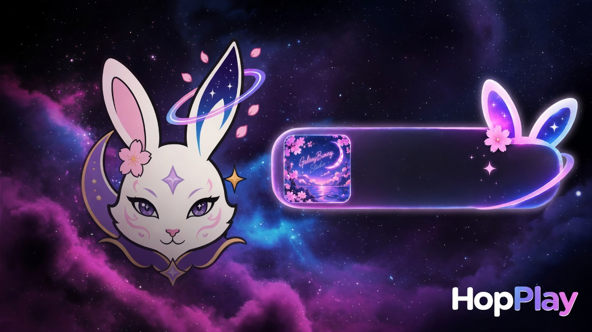
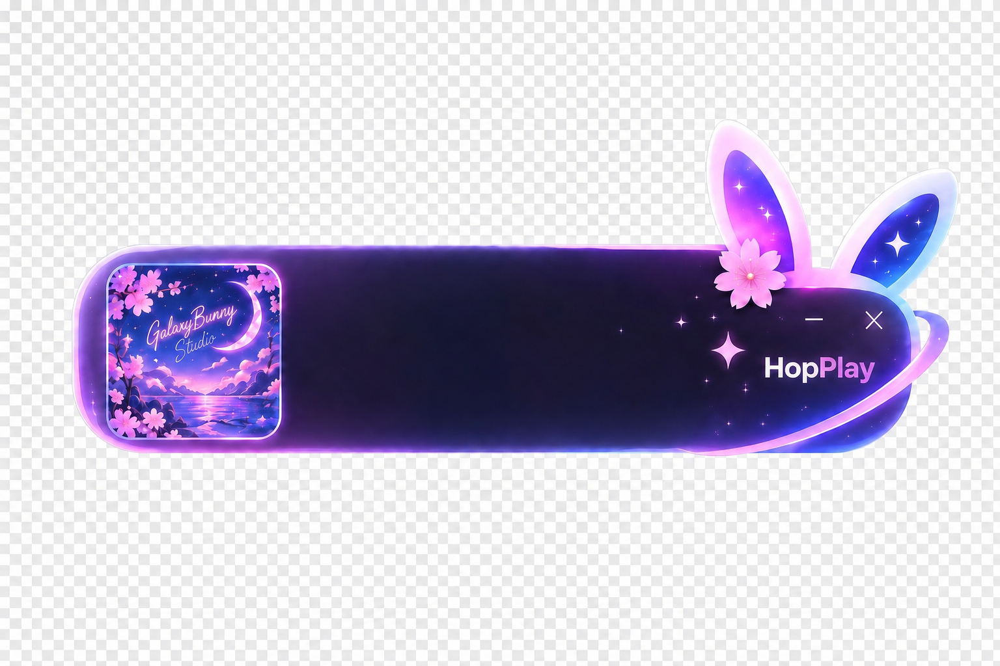
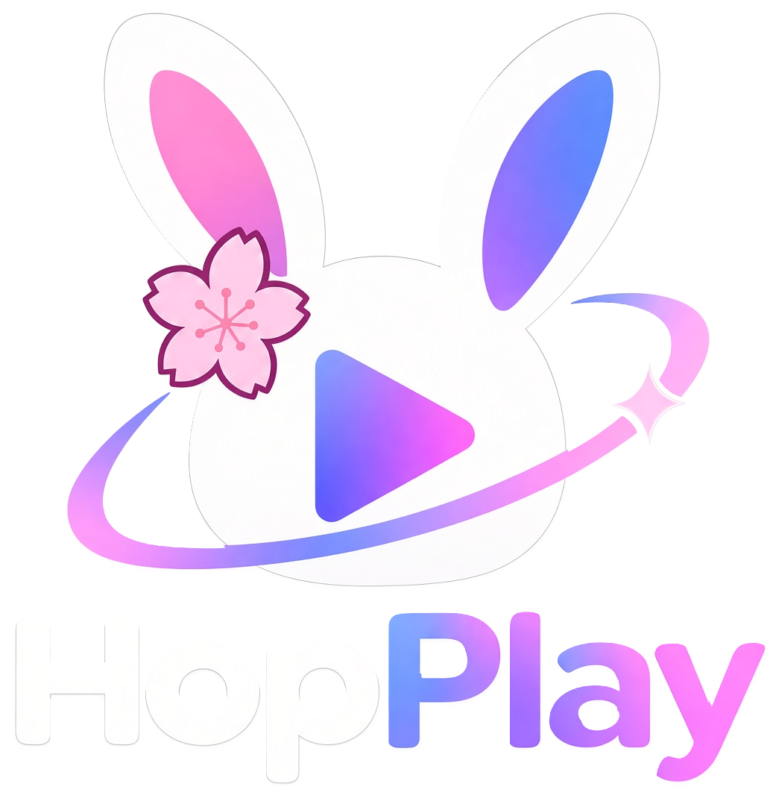

<p align="center">
  
</p>

<h1 align="center">HopPlay</h1>
<p align="center"><strong>GalaxyBunny Studio</strong> · overlay now playing</p>

<p align="center">
  Overlay local pour <strong>OBS</strong> et <strong>Streamlabs</strong> — titre, artiste, pochette, skins Galaxy Bunny.<br>
  Mode démo sans compte. Spotify optionnel.
</p>

<p align="center">
  <a href="https://hanacherry.github.io/hopplay/"></a>
  <a href="LICENSE"></a>
  <a href="package.json"></a>
  <a href="https://github.com/HanaCherry/hopplay/releases/latest"></a>
</p>

<p align="center">
  <a href="README.md">Français</a> ·
  <a href="README.en.md">English</a> ·
  <a href="https://hanacherry.github.io/hopplay/?lang=es">Español</a> ·
  <a href="https://hanacherry.github.io/hopplay/?lang=pt">Português</a> ·
  <a href="https://hanacherry.github.io/hopplay/?lang=de">Deutsch</a> ·
  <a href="https://hanacherry.github.io/hopplay/?lang=it">Italiano</a> ·
  <a href="https://hanacherry.github.io/hopplay/?lang=ja">日本語</a> ·
  <a href="https://hanacherry.github.io/hopplay/?lang=ko">한국어</a> ·
  <a href="https://hanacherry.github.io/hopplay/?lang=zh">简体中文</a> ·
  <a href="https://hanacherry.github.io/hopplay/?lang=zh-TW">繁體中文</a> ·
  <a href="https://hanacherry.github.io/hopplay/?lang=ar">العربية</a> ·
  <a href="https://hanacherry.github.io/hopplay/?lang=ru">Русский</a> ·
  <a href="https://hanacherry.github.io/hopplay/?lang=hi">हिन्दी</a> ·
  <a href="https://hanacherry.github.io/hopplay/?lang=tr">Türkçe</a> ·
  <a href="https://hanacherry.github.io/hopplay/?lang=pl">Polski</a> ·
  <a href="https://hanacherry.github.io/hopplay/?lang=nl">Nederlands</a> ·
  <a href="https://hanacherry.github.io/hopplay/?lang=id">Bahasa Indonesia</a> ·
  <a href="https://hanacherry.github.io/hopplay/?lang=vi">Tiếng Việt</a> ·
  <a href="https://hanacherry.github.io/hopplay/?lang=th">ไทย</a> ·
  <a href="https://hanacherry.github.io/hopplay/?lang=uk">Українська</a> ·
  <a href="https://hanacherry.github.io/hopplay/?lang=sv">Svenska</a> ·
  <a href="https://hanacherry.github.io/hopplay/?lang=cs">Čeština</a> ·
  <a href="https://hanacherry.github.io/hopplay/?lang=ro">Română</a> ·
  <a href="https://hanacherry.github.io/hopplay/?lang=el">Ελληνικά</a> ·
  <a href="https://hanacherry.github.io/hopplay/?lang=hu">Magyar</a> ·
  <a href="https://hanacherry.github.io/hopplay/?lang=fi">Suomi</a> ·
  <a href="https://hanacherry.github.io/hopplay/?lang=da">Dansk</a> ·
  <a href="https://hanacherry.github.io/hopplay/?lang=no">Norsk</a> ·
  <a href="https://hanacherry.github.io/hopplay/?lang=he">עברית</a> ·
  <a href="https://hanacherry.github.io/hopplay/?lang=ca">Català</a> ·
  <a href="https://hanacherry.github.io/hopplay/?lang=ms">Bahasa Melayu</a> ·
  <a href="https://hanacherry.github.io/hopplay/?lang=tl">Filipino</a>
</p>

<p align="center">
  <a href="https://hanacherry.github.io/hopplay/">Site de présentation</a>
  ·
  <a href="https://github.com/HanaCherry/hopplay/releases/latest">Dernière release</a>
</p>

<p align="center">
  
</p>

## Le titre en cours, sur le stream

HopPlay est un **overlay now playing** pour streamers : tableau de bord local, 61 skins dont **Galaxy Bunny**, fond transparent pour OBS / Streamlabs, jusqu’à 5 profils.

Le **mode démo** fonctionne sans compte. Spotify et la détection Windows restent optionnels. Rien n’est envoyé vers un serveur GalaxyBunny.

## Aperçu

<p align="center">
  
</p>

<p align="center">
  
</p>

## Fonctions

- **61 skins** — Galaxy Bunny, kawaii, chrome, walkman, film, sakura, tarot, arcade
- **Overlay OBS / Streamlabs** — source Navigateur, fond transparent, 9 positions
- **Spotify ou local** — compte optionnel, détection Windows, ou démo silencieuse
- **Apparence** — couleurs magiques, lueur, flou, visualiseur, pochettes carrée / canvas / vinyle
- **5 profils** — URL OBS, taille et opacité séparées
- **Privé par conception** — le serveur écoute `127.0.0.1` ; `data/` n’est pas publié

## Démarrage

Installez [Node.js 18+](https://nodejs.org), puis :

```sh
git clone https://github.com/HanaCherry/hopplay.git
cd hopplay
npm install
npm start
```

Ouvrez `http://127.0.0.1:3000`. Le mode démo fonctionne tout de suite.

Sous Windows, `start.bat` lance aussi le serveur. `stop.bat` l’arrête.

## OBS / Streamlabs

1. Démarrez HopPlay et laissez-le ouvert pendant le stream.
2. Copiez l’URL de l’overlay dans le dashboard.
3. Ajoutez une source **Navigateur**.
4. Collez l’URL. Fond transparent.

Taille conseillée : **1920 × 1080**.

## Spotify (optionnel)

1. Créez une app sur le [Spotify Developer Dashboard](https://developer.spotify.com/dashboard)
2. URI de redirection exacte : `http://127.0.0.1:3000/callback`
3. Collez le Client ID et le Client Secret **uniquement** dans le dashboard local
4. Autorisez, puis lancez un titre

Ne commitez jamais les secrets. Ils restent dans `data/` (gitignored).

## Licence

MIT © GalaxyBunny Studio
